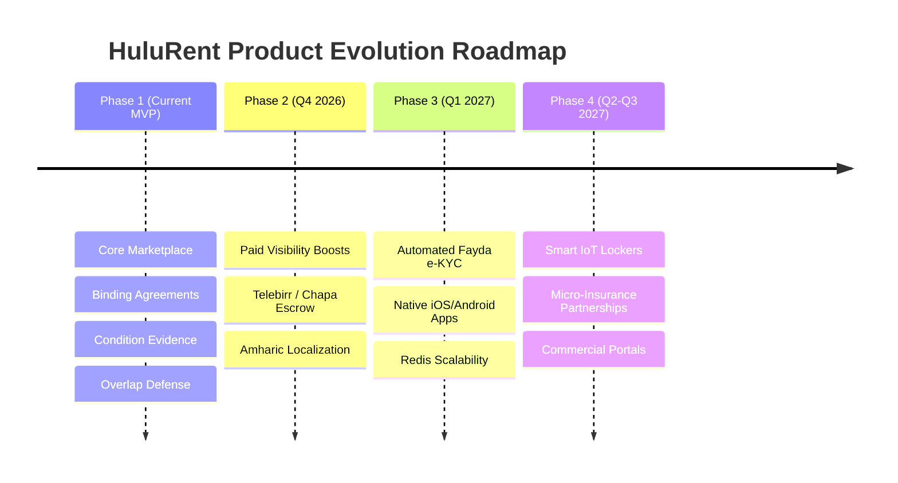

# HuluRent — Known Limitations & Future Roadmap

---

## 1. Known MVP Limitations

### 1.1 Payment & Deposit Processing
- **Current State**: HuluRent MVP acts as a digital agreement, transaction-recording, and trust layer. Payment for rentals and security deposits is handled directly between parties upon handoff.
- **Rationale**: Building full financial escrow custody within a 14-day development timeframe introduces substantial regulatory and payment provider overhead.
- **Mitigation**: The digital rental agreement explicitly documents agreed rental fees, deposit amounts, and damage liabilities, establishing legally binding terms.

### 1.2 Identity Verification
- **Current State**: Users submit ID references (National ID, Kebele ID, Passport) via `POST /api/identity-verification`. Status is reviewed and flagged by platform administrators.
- **Rationale**: Direct automated integration with national e-KYC APIs requires institutional clearance.

### 1.3 Client Platforms
- **Current State**: Responsive Web Client (React 18 + Vite) accessible on desktop, tablet, and mobile browsers.
- **Future State**: Dedicated native mobile applications (iOS and Android).

### 1.4 Single-Node Real-Time Messaging & Background Jobs
- **Current State**: Socket.IO connection manager and background cron jobs operate in-process on the single backend instance.
- **Rationale**: Optimal for MVP deployment simplicity and low operational footprint.

---

## 2. Strategic Post-MVP Roadmap

### 2.1 Post-MVP Monetization: Paid Visibility Boosts (Phase 2)
As documented in [`product/trust-and-liability.md`](trust-and-liability.md) §4, once marketplace volume expands, item owners can purchase **Featured Listing Boosts** to appear prominently at the top of category pages and search results. The database schema already includes a placeholder `Boost` model ready for activation.

### 2.2 Payment Gateway & Security Deposit Escrow (Phase 2)
Integration with Ethiopian fintech payment gateways (**Telebirr, Chapa, CBE Birr**):
- Automated rental fee escrow held until return condition is signed.
- Automated security deposit pre-authorization holds released upon satisfactory return.

### 2.3 Automated National ID (Fayda) e-KYC (Phase 3)
Integration with the **National ID Program (Fayda)**:
- Real-time biometric or OTP-based verification.
- Instant "Verified Citizen" trust badge generation.

### 2.4 Smart IoT Connected Lockers (Phase 4)
Partnerships with urban malls, co-working spaces, and fuel stations across Addis Ababa:
- Automated smart lockers for contactless equipment pickup and return.
- Unlocks via one-time QR code or dynamic PIN once the digital agreement and condition photos are submitted.

### 2.5 Third-Party Equipment Insurance (Phase 4)
Partnerships with local insurance underwriters (e.g. Nyala, Ethiopian Insurance Corporation):
- Optional per-rental damage protection add-on (e.g. 5–10% of rental fee) covering accidental drops and theft.
