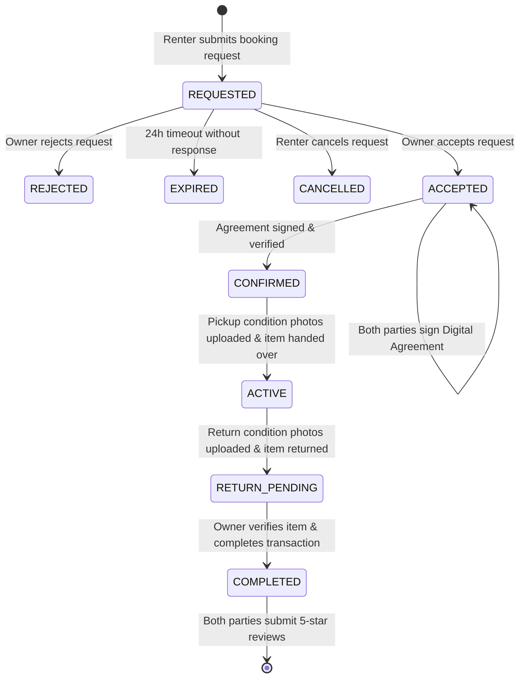

# HuluRent — Product & Functional Specification

---

## 1. Executive Summary & Vision

HuluRent is a hyper-local peer-to-peer rental marketplace designed to unlock the economic value of underutilized physical goods through verified trust, binding legal agreements, condition documentation, and two-sided reputation.

---

## 2. User Roles & Personas

| Persona | Role | Context & Objectives | Key Pain Points |
|---|---|---|---|
| **Alex (The Owner)** | Item Owner | Owns high-end photography gear and power tools. Wants passive income without risking uncompensated equipment damage or theft. | Fear of damaged items, ambiguous return expectations, awkward informal payment disputes. |
| **Sara (The Renter)** | Item Renter | Independent video producer. Needs specialized lenses for a 2-day client shoot without paying full retail purchase costs. | Prohibitive equipment purchase costs, lack of local availability, fear of false damage claims. |
| **Dawit (The Admin)** | Platform Moderator | Platform administrator ensuring marketplace safety, reviewing user reports, and restricting bad actors. | Ambiguous user disputes, lack of verifiable evidence, identity fraud. |

---

## 3. User Stories & Acceptance Criteria

### 3.1 Authentication & Identity Verification
- **US-01**: *As a new user, I want to register with my email, password, and name so that I can participate in the marketplace.*
  - **Acceptance Criteria**: Passwords hashed with bcrypt; JWT token returned upon registration; duplicate emails return `409 Conflict`.
- **US-02**: *As a user, I want to submit my identity verification reference (e.g. Fayda National ID) so that other users know I am a verified community member.*
  - **Acceptance Criteria**: Identity status tracks `UNVERIFIED → PENDING → VERIFIED | REJECTED`; public profile displays verified badge without exposing private document numbers.

### 3.2 Item Listings & Categorization
- **US-03**: *As an owner, I want to create listings with categories, pricing, photos, and approximate location so renters can discover my items.*
  - **Acceptance Criteria**: Listings support daily/hourly rates, security deposit amount, multi-photo uploads; exact coordinates are obscured into approximate location tags (e.g. "Bole · ~2.4 km away").
- **US-04**: *As an owner, I want to set custom blackout availability dates so renters cannot request my item when it is in personal use.*
  - **Acceptance Criteria**: Blackout ranges prevent conflicting booking submissions.

### 3.3 Search & Discovery
- **US-05**: *As a renter, I want to search listings by keyword, category, price range, and geographic distance so I can find tools nearby.*
  - **Acceptance Criteria**: Geospatial search calculates distance in kilometers using Haversine formula; only `PUBLISHED` listings appear in public search.

### 3.4 Booking Lifecycle & Conflict Prevention
- **US-06**: *As a renter, I want to request a rental booking for specific dates and receive confirmation without the risk of double-booking.*
  - **Acceptance Criteria**: Dual-layer overlap prevention: application row locks (`SELECT FOR UPDATE`) + PostgreSQL exclusion constraint (`EXCLUDE USING gist`) prevent overlapping `CONFIRMED` or `ACTIVE` bookings on the same item.
- **US-07**: *As an owner, I want to review incoming rental requests and accept or reject them within a defined time window.*
  - **Acceptance Criteria**: Owner can `ACCEPT` or `REJECT`; unaccepted requests auto-expire via scheduled background jobs.

### 3.5 Pre-Rental Physical Inspections
- **US-08**: *As a renter or owner, I want to schedule a physical pre-rental inspection appointment to test high-value equipment before finalizing handoff.*
  - **Acceptance Criteria**: Either party can propose date/time and notes; counter-party can confirm or cancel.

### 3.6 Digital Rental Agreements
- **US-09**: *As a renter and owner, I want to sign a versioned digital rental agreement that explicitly defines liability, permitted use, and handoff terms.*
  - **Acceptance Criteria**: Agreement generated automatically with pricing, dates, and off-platform handoff disclaimers; both parties must sign digitally (`ownerAccepted` & `renterAccepted`) before booking transitions to `CONFIRMED`.

### 3.7 Transaction-Linked Real-Time Chat
- **US-10**: *As a renter and owner, I want to communicate in real time about pickup logistics directly inside the transaction.*
  - **Acceptance Criteria**: Messages are scoped to specific bookings; real-time delivery powered by WebSockets (Socket.IO).

### 3.8 Condition Evidence Documentation
- **US-11**: *As a renter and owner, I want to upload timestamped condition photos and notes at pickup and return so that existing wear is documented.*
  - **Acceptance Criteria**: High-resolution photos uploaded with condition notes; counter-party acknowledges condition record; evidence cannot be deleted or modified post-submission.

### 3.9 Two-Sided Reviews & Reputation
- **US-12**: *As a user on a completed rental, I want to rate and review the other party so that the community benefits from transparent reputation.*
  - **Acceptance Criteria**: Reviews are strictly restricted to `COMPLETED` bookings; each party can submit exactly one review per booking (`@@unique([bookingId, authorId])`).

### 3.10 Platform Governance & Moderation
- **US-13**: *As a user, I want to report abusive behavior or fraudulent listings to administrators.*
  - **Acceptance Criteria**: Reports enter moderation queue with `OPEN` status; admin can investigate and resolve.
- **US-14**: *As an admin, I want to restrict bad-actor accounts and review system audit logs.*
  - **Acceptance Criteria**: Admin actions (account restrictions, report resolution) generate immutable `AuditEvent` records.

---

## 4. End-to-End Workflow Diagram

---

## 5. Non-Functional & Security Requirements

1. **Performance & Scalability**:
   - API response latency under 150ms for search and listing retrieval at p95.
   - Real-time chat delivery under 200ms latency.
2. **Data Privacy & Location Protection**:
   - Exact coordinates never exposed over public endpoints.
   - Identity verification records never expose full national ID numbers to peers.
3. **Security Standards**:
   - Passwords hashed with bcrypt (minimum cost factor 10).
   - Stateless JWT tokens signed with secure 256-bit secret.
   - Route-level ownership guard on all resource modifications.
   - Comprehensive input validation using schema validators before controllers are invoked.
